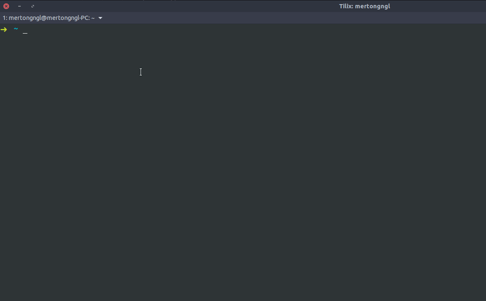
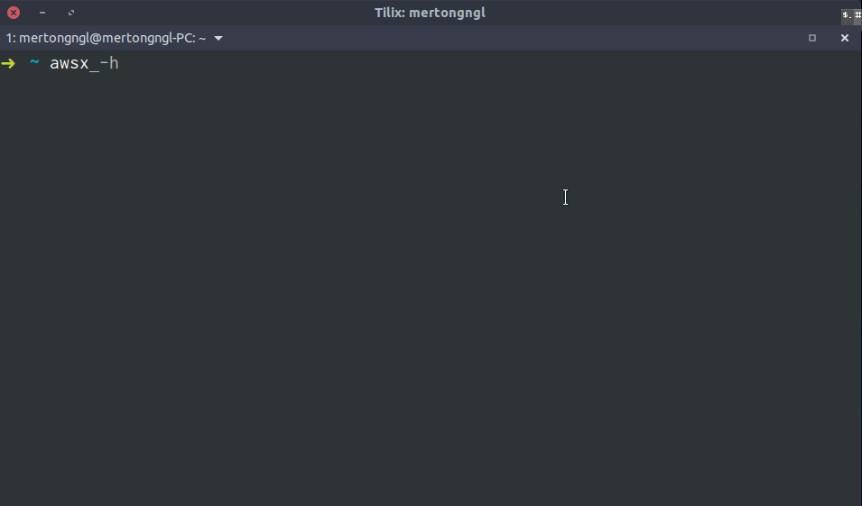
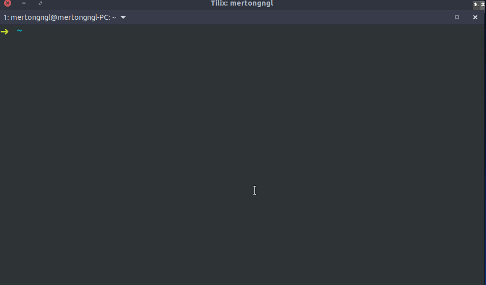

# `awsx` for switching awscli creds

**`awsx`** helps you switch between aws credentials:

## Requirements

- You should have `awscli`

## Installation

### `Linux` & `macOS`

Command:

    sudo cp awsx /bin/awsx
    sudo chmod +x /bin/awsx

## Notes

- `--list`/`-l` : Listing your credentials

    

- `--help`/`-h` : Showing help menu

    

- `--add`/`-a` : Copying your .aws/* files to .aws.configs/ directory with given name.

    

- `--remove`/`-r` : Removing your credentials from .aws.configs/ directory

    

